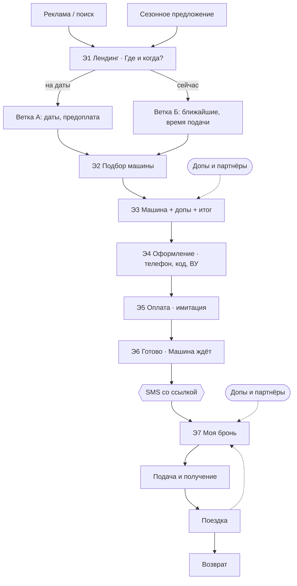

# Путь клиента — спецификация v0.1

Рабочий черновик, 03.10.2026. Задача — собрать сценарий получения машины и понять, сколько экранов делать. Визуала пока нет: следующий шаг — ч/б функциональный вайрфрейм-прототип, где сценарий проходит от начала до конца.

Пометки: **[рынок]** — так делают существующие сервисы; **[наше]** — наше решение или отличие.

## Принципы

- **Без приложения.** Всё оформляется на лендинге, в десктопе и мобайле. [наше] (у Яндекс Драйва, Ситидрайва, Делимобиля управление арендой идёт через приложение.)
- **Авторизация — имитация:** телефон и код из SMS, подходит любой код.
- **Одна ссылка возврата.** После брони приходит SMS со ссылкой на страницу «Моя бронь». Через неё дальше идёт всё: статус, подача, допы, продление, возврат.
- **Минимум экранов.** Склеиваем шаги, где можно. Цель — около 7 экранов.
- **Отличие от рынка — допы и партнёры** (инвентарь, скипасс, маршруты). Это дополнительная монетизация, а не только аренда машины.

## Две ветки

| | А. «Планирую» | Б. «Уже приехал» |
|---|---|---|
| Режим в «Где и когда?» | на даты | сейчас |
| Что важно | цена, машины, документы, гарантия | скорость: ближайшая машина и время подачи |
| Оплата | предоплата 15–20% как гарантия брони [рынок: Localrent] | предоплата или депозит прямо сейчас |
| В SMS | «Машина закреплена за вами на 12–19 янв.» | «Машина будет у вас через 40 минут» |

Ветки расходятся на первом экране и сходятся на оформлении. Дальше путь общий.

## Шаги и экраны

### Э1. Лендинг: вход и «Где и когда?»
- **Клиент:** приходит с рекламы или поиска; видит сезонные предложения (горнолыжка, море, выходные) или сразу вводит место и время.
- **Экран:** первый экран с блоком «Где и когда?»:
  - локация: аэропорт, вокзал, отель или адрес;
  - переключатель «сейчас / на даты»;
  - для «на даты» — даты и время.

  Ниже — сезонные предложения: клик по карточке сразу подставляет локацию и набор допов.
- **Данные:** локация, режим, даты.
- [рынок] у прокатов поиск начинается с места и дат; [наше] режим «сейчас» и вход через сезонное предложение.

### Э2. Подбор машины
- **Клиент:** смотрит доступные машины и выбирает конкретную, а не класс.
- **Экран:** список карточек: фото, модель, цена за сутки и итог за период, теги («4×4», «багажник 500 л», «есть бокс», «без оклейки»). Фильтры: класс, коробка, места, инвентарь.
  - Ветка Б: сортировка по близости, на карточке — «будет через 40 мин».
- **Данные:** выбранная машина.
- [рынок] карточки с тегами; конкретная машина вместо класса — у Localrent; [наше] время подачи на карточке.

### Э3. Машина, допы и итог
- **Клиент:** уточняет детали, добавляет то, что нужно в поездку, и видит итоговую цену.
- **Экран:** одна страница из трёх блоков:
  1. **Машина:** фото, характеристики, что входит (страховка, пробег, депозит).
  2. **Допы к машине** [рынок]: детское кресло, второй водитель, полная страховка, доставка к отелю.
  3. **Для поездки** [наше] — см. блок «Допы и партнёры» ниже: бокс и крепления, снаряжение от партнёра, скипасс.

  Калькулятор итога сбоку (на мобайле — внизу): аренда + допы + депозит. Кнопка «Забронировать».
- **Данные:** допы, итоговая сумма.

### Э4. Оформление
- **Клиент:** оставляет минимум данных, чтобы забронировать.
- **Экран:** одна форма:
  1. телефон → код из SMS (имитация);
  2. имя;
  3. водительское удостоверение — фото или номер (упрощённо; в реальности нужны ещё паспорт и проверка стажа и возраста [рынок]).
- **Данные:** телефон, имя, ВУ.
- [наше] без ожидания звонка менеджера: в отличие от конкурентов («WTF, надо ждать звонка?»), бронь подтверждается сразу.

### Э5. Оплата (имитация)
- **Клиент:** вносит предоплату.
- **Экран:** сумма к оплате сейчас и при получении, депозит (блокируется, а не списывается), условия отмены (бесплатно за 24 ч [рынок]). Кнопка «Оплатить».
- Можно склеить с Э4 → тогда экранов 6.

### Э6. Готово: «Машина ждёт»
- **Клиент:** видит, что всё оформлено.
- **Экран:** анимация успеха и короткое резюме: машина, где и когда подача, что взять с собой (ВУ, паспорт). Превью SMS прямо на экране — чтобы в прототипе было видно, что ушло клиенту.
- **SMS:**
  > Машина ждёт вас: Haval Jolion, аэропорт Сочи, 12 янв 14:00. Бокс и лыжи уже внутри. Всё о брони: rent.ru/b/7KQ2

### Э7. «Моя бронь» (по ссылке из SMS)
Единственная точка возврата. Её состояние меняется по этапам: до подачи → подача → получение → в поездке → возврат. Что на странице на каждом этапе — в [spec.md](spec.md#э7-этапы-моей-брони).

- [рынок] у прокатов это делают приложение или менеджер; [наше] — одна веб-страница по ссылке.

## Допы и партнёры — наше отличие

**Где появляются:**
1. на лендинге — сезонное предложение как готовый набор («Горнолыжка: кроссовер + бокс + скипасс»);
2. на Э3 — блок «Для поездки»;
3. на Э7 — до подачи («ещё успеете добавить») и в поездке (рекомендации рядом).

**Что продаём:**

| Категория | Примеры | Как зарабатываем | У конкурентов |
|---|---|---|---|
| Инвентарь к машине | бокс, крепления для лыж, сноуборда, велосипеда, сапа | своя аренда | бокс есть у части прокатов, на лендингах не продаётся |
| Снаряжение | лыжи, сноуборд, сап, сёрф, велосипед — **уже в машине при подаче** | комиссия партнёра-проката | нет |
| Активности | скипасс, экскурсии, маршруты, инструктор | комиссия | нет |
| Поездка | отель, трансфер багажа, страховка путешествия | комиссия или наценка | частично у Островка (отель + машина) |
| Сервис машины | доставка к отелю или в аэропорт, второй водитель, кресло | своя наценка | есть [рынок] |

Главная фишка для демонстрации: **«снаряжение уже в машине»** — машина подъезжает, лыжи внутри.

## Схема

## Экраны для дизайна

Список экранов и состояний — в [spec.md](spec.md).

## Открытые вопросы для шлифовки

1. ~~Э4 и Э5 — один экран или два?~~ → **решено 05.10: один экран.**
2. Э7 — сколько этапов показываем в прототипе?
3. Ветка Б — нужен ли отдельный быстрый путь с минимумом шагов (без Э2: «дайте ближайшую»)?
4. Допы и партнёры — какой набор показываем в демке: горнолыжка, море или оба?
5. Где оплата допов от партнёров — вместе с арендой или отдельно?

## Источники

- [Localrent — предоплата 15–20%, выбор конкретной машины](https://www.travelpayouts.com/ru/blog/?p=771)
- [Прокат авто в Краснодаре — пошаговая инструкция](https://www.sostav.ru/blogs/290007/95858)
- [Доп. услуги при аренде авто в Сочи](https://www.sostav.ru/blogs/288464/82194)
- [За рулём — багажник на крышу: покупать или арендовать](https://www.zr.ru/content/articles/907110-bagazhnik-na-kryshu-pokupat-il/)
- Свои хайлайты по лендингам конкурентов — [research.md](research.md)
